# Proyecto de Aplicación de Magic the Gathering

Autores: **Sergio Prieto García** y **Manuel Cendón Rdodríguez**

## 1. Introducción

### 1.1 Descripción del Proyecto

Este proyecto tiene como finalidad crear una aplicación que permita consultar información de las cartas del aclamado juego de cartas Magic: The Gathering. La aplicación permite buscar cartas por nombre y muestra la información más relevante de las mismas.


#### Funcionalidades principales:

- **Búsqueda de cartas:** La aplicación permite buscar cartas por nombre.
- **Información detallada:** Muestra información detallada de las cartas, como su nombre, tipo, coste de maná, color, fuerza, resistencia e imagen.
- **Interfaz gráfica:** La aplicación cuenta con una interfaz gráfica de usuario (GUI) que facilita la interacción con el usuario.
- **API de Magic: The Gathering:** La aplicación utiliza la API de Magic: The Gathering para obtener información de las cartas.
- **Gestión de errores:** La aplicación gestiona los errores que puedan surgir durante la búsqueda de cartas y muestra mensajes de error al usuario.
- **LogIn y Usuarios:** La aplicación cuenta con un sistema de logIn de usuarios para poder acceder a la información de las cartas de forma personalizada.
- **Últimas búsquedas:** La aplicación guarda las últimas búsquedas realizadas por el usuario.
- **Caché:** La aplicación guarda las búsquedas en caché para no tener que recurrir siempre a la pi

### 1.2 Descripción de la API

La API de Magic: The Gathering es una API REST que permite obtener información sobre las cartas del juego Magic: The Gathering. La información se devuelve en formato JSON y se puede acceder a ella mediante peticiones HTTP.

#### Endpoints utilizados:

- **GET https://api.magicthegathering.io/v1/cards?name={cardName}**: Devuelve la información de una carta específica buscando por nombre.

### 1.3 Ejemplo de solicitud API en POSTMAN

Utilizamos postman para realizar las peticiones a la API y obtener la información para corroborar que la application nos devuelve los datos que deseamos en el formato correcto.

#### Ejemplos de URL para obtener información de una serie:

   - **URL**:https://api.magicthegathering.io/v1/cards?name=Plains
   - **Método**: GET

**Captura de Postman**:
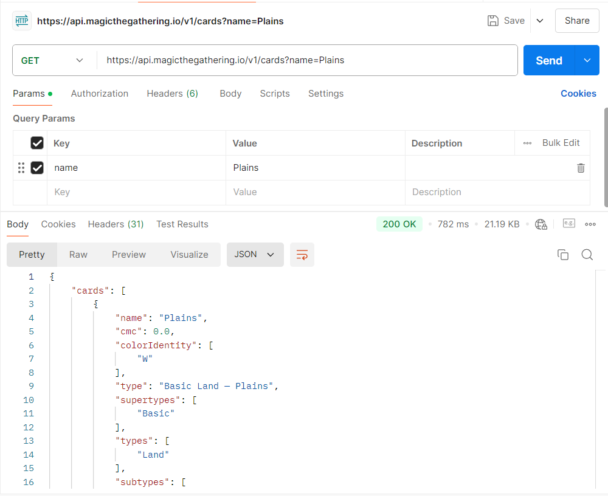

   - **URL**:https://api.magicthegathering.io/v1/cards?name=Skullclamp
   - **Método**: GET

**Captura de Postman**:
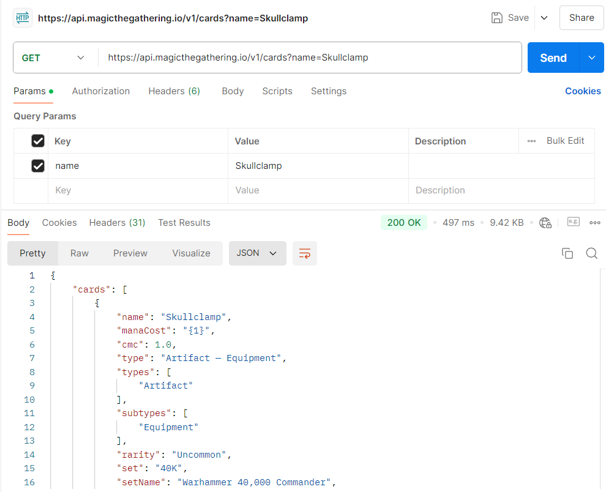

   - **URL**:https://api.magicthegathering.io/v1/cards?name=Cleanse
   - **Método**: GET

**Captura de Postman**:
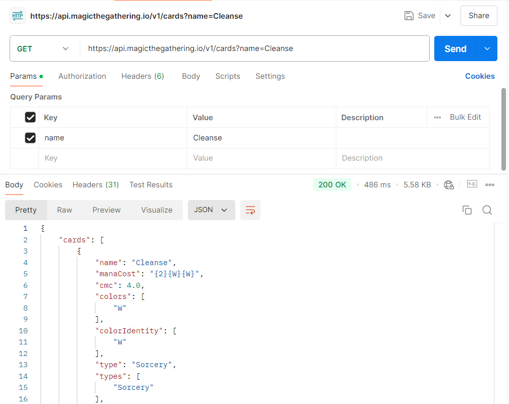

### 1.4 Tecnologías utilizadas

### 1.4 Tecnologías utilizadas
Este proyecto ha sido desarrollado con las siguientes tecnologías:
- **Java**: Lenguaje de programación principal utilizado.
- **JavaFX**: Para la creación de la interfaz gráfica de usuario (GUI).
- **FXML**: Lenguaje utilizado para diseñar las vistas de la aplicación.
- **Maven**: Utilizado para la gestión de dependencias y la construcción del proyecto.
- **API REST**: Para obtener los datos de series a través de solicitudes HTTP.
- **W3C**: Para manejar el mappeado a XML y JSON.
- **JDOM2**: Para manejar el mappeado a XML.
## 2. Estructura del Proyecto

El proyecto sigue el patrón de arquitectura **MVC (Model-View-Controller)**.

- **Model**: Esta capa gestiona la lógica. Aquí se define la estructura de los datos y las interacciones con la API.
- **View**: Los archivos **FXML** definen la interfaz gráfica.
- **Controller**: maneja la interacción entre el *model* y la *view*

## 2.1 Descripción de las clases en el paquete `controller`

1. **`LoginController`**: Esta clase maneja la funcionalidad de inicio de sesión de los usuarios. Permite que los usuarios ingresen sus credenciales y autentifica su acceso.

   - Métodos importantes:
      - tryToLogIN(): Autentifica al usuario y en caso de no existir en el JSON que guarda nuestros usuarios salta una ventana de error y no permite entrar.
      
      - loadMainView(): método que al pasar correctamente el anterior método mencionado te lleva a la pestaña principal

2. **`MainWindowController`**: es la clase que maneja la pantalla principal, como se muestran las cartas y el botón para pasar a la ventana de exportación.

    - Métodos importantes:
      - **SearchInformation(ActionEvent event)**: Es la función principal y la que después de hacer *click* en el botón de buscar, hace la petición a la API (o al caché) para luego mostrar los datos con el siguiente método.
      - **mostrarDatos(Response response, String nameInput)**: Después de buscar en la API (o en el caché), muestra en la pantalla principal las características que nosotros decidimos mostrar de cada carta.
      - **cargarUltimaBusqueda(String nombreUsuario)**: carga la última búsqueda del usuario en el que se hizo un *Log In* exitoso y se haya buscado una carta.
      - **toExportView(ActionEvent event)**: cambia a la **ventana de exportación (secondWindowController).**
      - **toLogin(ActionEvent event)**: vuelve al *Log In* para volver a entrar con un usuario diferente o con el mismo.
      - **closeApp(ActionEvent actionEvent)**: cierra la aplicación despues de darle al botón correspondiente.
      - **fetchApiData()**: guarda la consulta a la API para que se pueda exportar en la **ventana de exportación**.

3. **`secondWindowController`**: es la clase que maneja la ventana de exportación a los 4 tipos de archivo que se pidieron en la descripción del proyecto: JSON, BIN, TXT y XML. Además el usuario le debe de poner nombre. Si no se seleccionó ninguna carta, no se puso nombre o no dejaron el tipo de archivo en 

## <u>Estructura del código</u>

## 2.2 Relación entre las clases 

## 2.3 Descripción del paquete `model`

## 2.4 Descripción del paquete `service`

## 2.5 Descripción del paquete `users`


## 2.6 `src/main/resources` – Almacenamiento de FXML y Recursos

La carpeta `src/main/resources` contiene todos los archivos necesarios para la interfaz gráfica de usuario y otros recursos estáticos.

### Subcarpetas clave y archivos:

### Relación entre los controladores y los archivos FXML

# <u>Manual para Desarrolladores</u>

## Requisitos del Sistema
### Antes de comenzar, asegúrate de que tienes instalados los siguientes componentes en tu sistema:
1. JDK 21: Necesario para compilar y ejecutar aplicaciones Java.
2. JavaFX 17: Usado para la interfaz gráfica de usuario (GUI) en Java.
3. Maven: Herramienta para la gestión de proyectos y dependencias en Java.
4. Git: Sistema de control de versiones para gestionar el código fuente.

## Instrucciones de Instalación

### 1. Sitúate donde quieras crear la app:

```bash
cd C:\Users\nombredeusuario\Desktop
```
### 2. Crea un directorio donde almacenar la app:

```bash
  mkdir Directory
```

### 3.Sitúate en el directorio:

```bash
  cd Directory
```

### 4.Instala los requisitos:

#### Instalar JDK 21:

- Si no tienes JDK instalado, descárgalo e instálalo desde Oracle JDK 21.
- Durante la instalación, asegúrate de seleccionar la opción de añadir Java al PATH para que puedas usarlo desde la línea de comandos.

- Verifica la instalación de Java ejecutando el siguiente comando en la terminal:
```bash
java --version

```
#### Instalar JavaFX 17:

- Descarga JavaFX 17 desde [Gluon](https://gluonhq.com/products/javafx/).
- Descomprime el archivo descargado en un directorio de tu elección.
- Debes configurar las variables de entorno para JavaFX. En Windows, añade la ruta del directorio lib de JavaFX a la variable de entorno PATH.
- Para verificar, puedes ejecutar el siguiente comando, reemplazando ruta_a_javafx por la ruta de la carpeta lib:
```bash
set PATH=%PATH%;ruta_a_javafx\lib
```
#### Instalar Maven:
- Si no tienes Maven instalado, descárgalo e instálalo desde [Apache Maven](https://maven.apache.org/download.cgi).
- Descomprime el archivo descargado en un directorio de tu elección.
- Añaade la ruta de la carpeta bin de Maven a la variable de entorno PATH.
- Para verificar la instalación, ejecuta el siguiente comando en la terminal:
```bash
mvn --version
```
#### Instalar Git:
- Si no tienes Git instalado, descárgalo e instálalo desde [Git](https://git-scm.com/downloads).
- Durante la instalación, asegúrate de seleccionar la opción de añadir Git al PATH para que puedas usarlo desde la línea de comandos.
- Verifica la instalación de Git ejecutando el siguiente comando en la terminal:
```bash
git --version
```
### 5. Clona el repositorio de la aplicación:

```bash
   git clone https://github.com/Semperz/MagicTGAPI.git
```

### 6. Sitúate en el directorio del proyecto:

```bash
    cd MagicTGAPI
  ```

### 7. Instala las dependencias del proyecto:
```bash
    mvn  install
```
### 8. Ejecuta la aplicación:
#### Para Crear el JAR

```bash
    mvn clean package
```

#### Para ejecutar con el JAR

```bash
    
 java --module-path="ruta al directorio del SDKS" --add-modules=javafx.base,javafx.controls,javafx.fxml,javafx.graphics,javafx.swing,javafx.media
```

# <u>Manual de Usuario</u>

## Inicio de Sesión

Al abrir la aplicación, te llevará a la pantalla de LogIn:

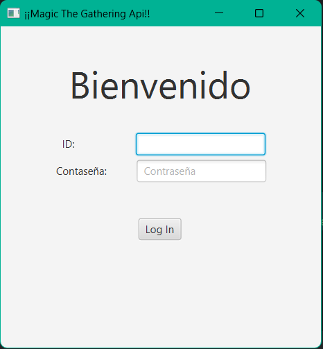

En ella deberás introducir tu nombre de usuario y contraseña:

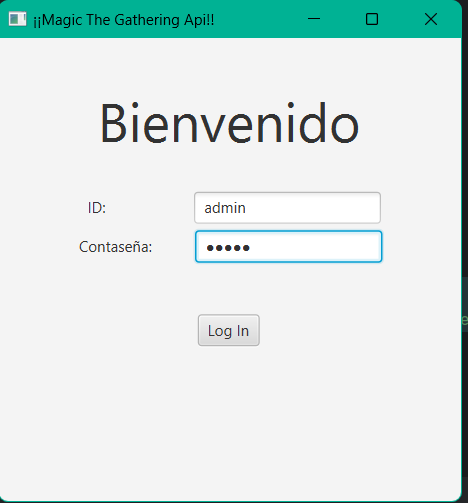

Si introduces un usuario que no existe, te saltará un mensaje de error:

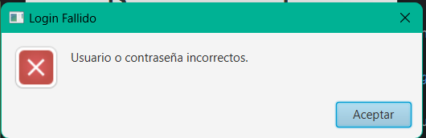

Si introduces un usuario que sí existe, te saldrá una notificación de que has iniciado sesión correctamente:

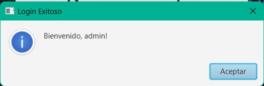

Ademas de preguntarte si quieres cargar la última búsqueda que hiciste:

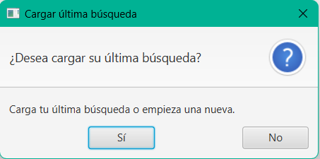

Una vez has seleccionado si quieres cargar la última búsqueda o no, te llevará a la pantalla principal:
En ella podrás buscar cartas por nombre, salir de la aplicación, volver a la pantalla e LogIn o ir a la pantalla de exportar datos.

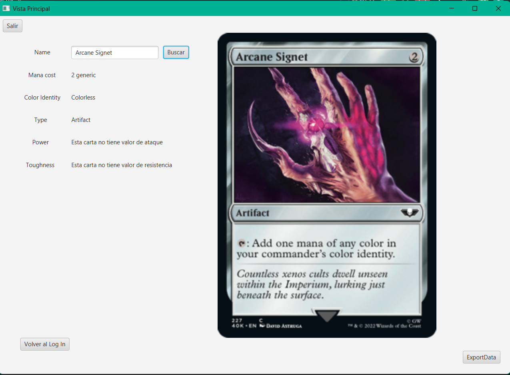


Si decides ir a la pantalla de exportación de datos, esta sera tu vista:

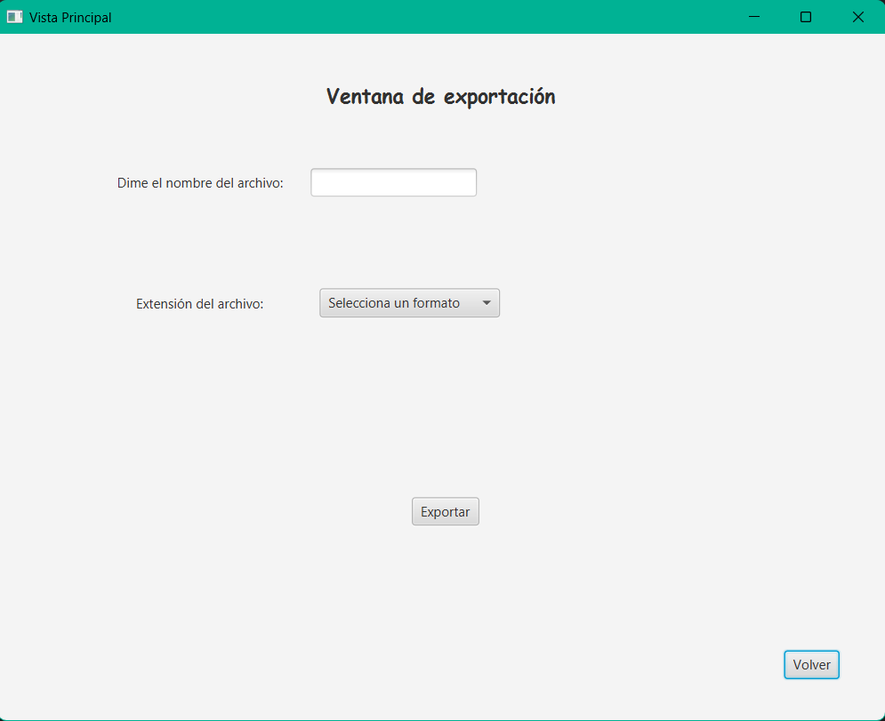

En ella puedes elegir el formato en el que quieres exportar el archivo:

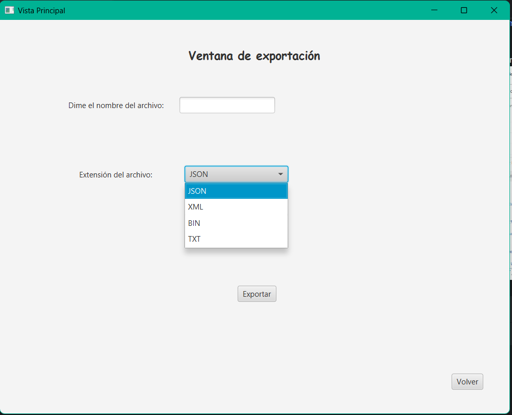

Una vez introducidos todos los datos y clickado el botón de exportar, te saltará un mensaje de aviso:

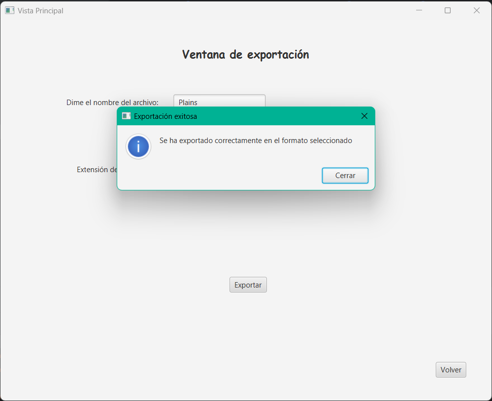

Y se te guardará el resultado en un directorio llamado exports:

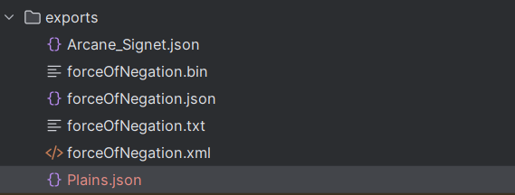


# Extras Realizados

# Tiempo dedicado

# Propuestas de Mejora

# Conclusiones


